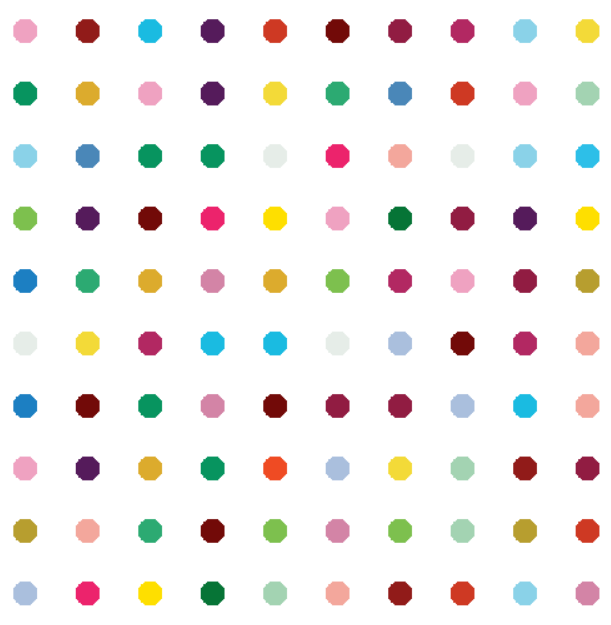

# 🎨 Hirst Painting Project (Day 18)

This project recreates a Damien Hirst-style dot painting using Python's `turtle` graphics module.  
It uses the `colorgram` library to extract colors from an image and draw a grid of colored dots.

## 🌈 Features
- Extracts dominant colors from an image using `colorgram`
- Creates a grid of colored dots using the `turtle` module
- Beautiful output that resembles Hirst's artwork

## 📸 Screenshots

## 📚 Based on:
Day 18 of the [100 Days of Code: Python Bootcamp by App Brewery](https://www.udemy.com/course/100-days-of-code/)

## 👤 Author
- [Rudransh Tanwar](https://github.com/rudranshstanwar)